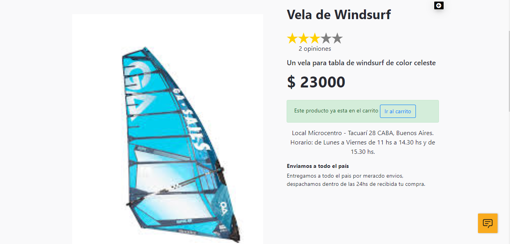
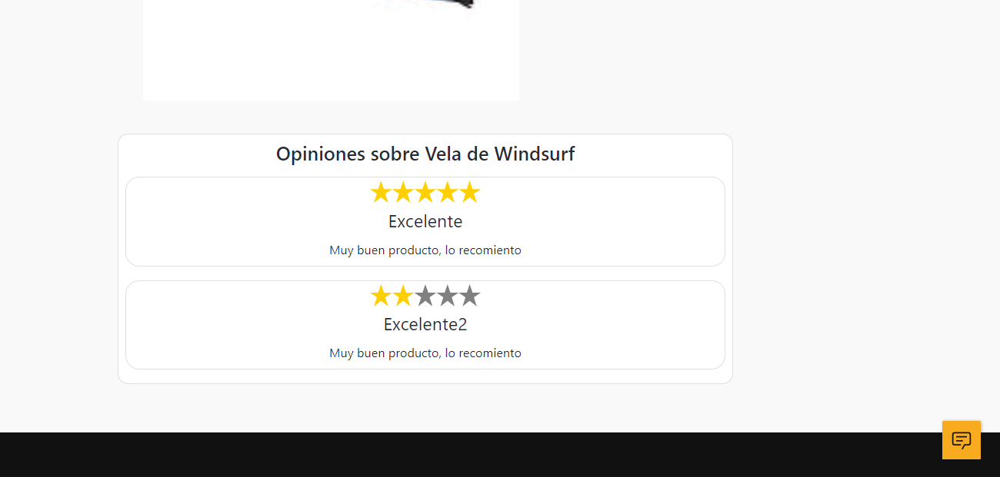
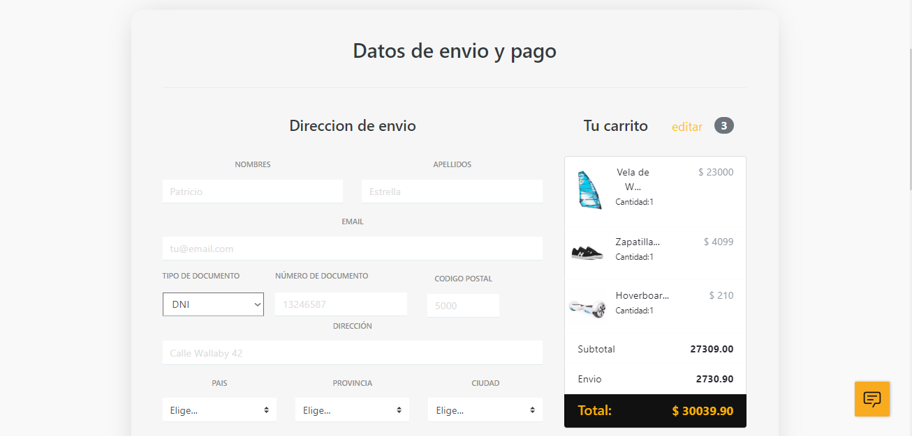
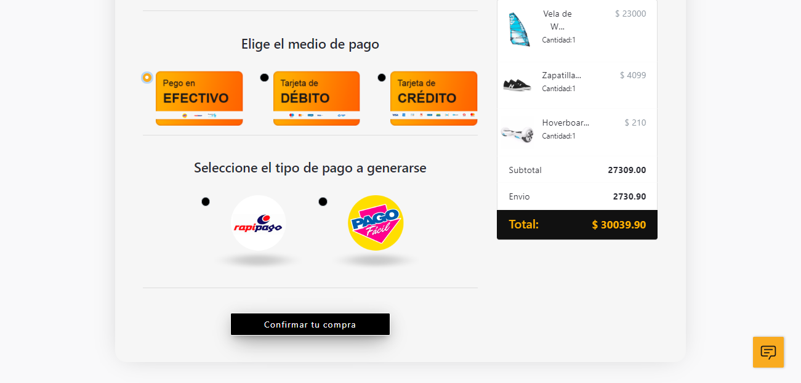

# E-Commerce

## Objetivos del Proyecto
- Construir una App JavaScript desde cero.
- Afirmar y conectar los conceptos aprendidos en la carrera.
- Aprender mejores prácticas.
- Aprender y practicar el workflow de GIT.
- Utilizar Metodologías Ágiles.
- Trabajar en equipo.

### Requerimientos

La aplicación del e-commerce va a contar con los siguientes requerimientos:

__IMPORTANTE:__ Es necesario contar minimamente con la última versión estable de Node y NPM. Asegurarse de contar con ella para poder instalar correctamente las dependecias necesarias para correr el proyecto.

Para verificar que versión tienen instalada:

> node -v
>
> npm -v

Para levantar el proyecto primero asegurarse de tener en /api un archivo .env con las siguientes variables de entorno:

(Las variables que comienzan con DB están relacionadas a la base de datos, en este proyecto se usó postgeSQL.
Las demas variables corresponden al puerto del servidor de back-end, las Cookies, y claves.
Se debe crear una base de datos en postgres con el nombre "development" )

DB_USER =
DB_PASSWORD =
DB_HOST = 
port =
COOKIE =
apiKey =
domain =
hostF =

Para levantar el proyecto correr los siguientes comandos tanto en \api como en \client: 
- npm install 
- npm start

### Historia de usuario del proyecto
##### Como un usuario invitado yo quiero...

- PRODUCTOS:
    + ...ver la lista completa de productos (catálogo), para ver todo lo disponible para comprar.
    + ...refinar el listado por categorías, para poder ver los items en los que estoy interesado.
    + ...buscas productos, para poder encontrar rápido los productos que quiero comprar.
    + ...ver los detalles de un producto individual (incluida las fotos, descripciones, reviews, etc...), asi puede determinar si quiero ese producto o no.

- CARRITO:
    + ...poder agregar items a mi carrito de compras desde el listado o desde a página de detalles de un producto, para poder comprarlos despues.
    + ...sacar items de mi carrito, en caso que decida no quererlos.
    + ...editar cantidades de los items de mi carrito, en caso que quiera mas o menos cantidad de un item en particular.
    + ...refrescar la página, o irme y volver, y todavía tener mi carrito de compras (sin haberme creado una cuenta). (Podés usar sessionStorage, localStorage, cookies, o JWT).
    + ...poder crearme una cuenta, loguearme y seguir editando ese mismo carrito, asi no pierdo los items seleccionados.
- CHECKOUT:
    + ...poder comprar todos los items de un mi carrito.
    + ...especificar una dirección de envio y un email cuando hago el checkout, asi me envien la compra a lugar que dije.
    + ...recibir un email de confirmación que hice la compra.
    + ...recibir un email de notificación cuando la orden fue despachada.
- GESTION DE CUENTA:
    + ...poder crear una cuenta, asi puede hacer otras cosas como dejar un review.
    + ...poder logearme usando Google o Github, para no tener que acordarme de un password nuevo.

Los usuarios que hayan creado su cuenta, podrán hacer todo lo que puede hacer un usuario guest y además:
###### Como un Usuario Autenticado yo quiero...

- GESTION DE CUENTA:
    + ...poder desloguearme, asi nadie más pueda usar mi sesión.
    + ...ver el historial de ordenes previas, asi puede reever las ordenes que hice en el pasado.
    + ...ver los detalles de una orden que hice en el pasado, incluyendo:
        * Los items comprados, con sus cantidades.
        * Links a la página del producto comprado.
        * Fecha y hora de la compra.
- REVIEWS:
    + ...poder dejar reviews a los productos, que incluyan texto y un sistema de cinco estrellas.

### Admin

Los usuarios administradores pueden manejar el sitio, los productos que se listan y los items que están disponibles.

#### Como un administrador yo quiero...

- GESTION DE PRODUCTOS:
    + ...poder crear y editar productos, con nombre, descripción, precio y uno o más fotos, tal que los visitantes puedan ver la última información de lo que se vende.
    + ...poder crear categorías, para que los usuarios puedan filtrar los items.
    + ...poder agregar o sacar categorías de los items (los items deben poder aceptar múltiples categorías).
    + ...gestionar la disponibilidad de un item. (un item que no esta disponible, no deberá estar listado en la página, pero su detalle debe seguir siendo accesible desde el historial de compras o con su URL, pero debe mencionar que el item no está disponible).

- GESTION DE ORDENES:
    + ...poder ver una lista de todas las ordenes, para poder ver y revisar las ordener.
    + ...poder filtrar as ordenes por su estado (creada, procesando, cancelada, completa).
    + ver los detalles de una orden específica, asi puedo revisarla y actualizar su estado.
    + ...poder cambiar el estado de una orden (creada => procesando, procesando => cancelada || completa).

- GESTION DE USUARIOS:
    + ...poder hacer que un usuario se convierta en admin.
    + ...borrar a un usuario, asi no puedan logearse más.
    + ...forzar una password reset para un usuario.

### Validación de Datos

Cuando crees los modelos, debes considerar los tipos de datos que vas a recibir, qué cosas van a ser requeridas y cómo vas a devolver los errores a los usuarios.
Algunas constrains qué deberás implementar:

- Productos:
    + Deben tener `titulo`, `descripcion`, `precio`, `cantidad`
    + Deben pertenecer a por lo menos una categoría.
    + Deben tener una foto, si no tienen una foto, deben tener un placeholder de foto por defecto.
- Usuarios:
    + Deben tener una dirección de mail válida.
    + Su email debe ser único.
- Ordenes:
    + Una orden debe pertenecer a un usuario o a un guest (autenticado vs no autenticado).
    + Las ordenes deben tener línea de orden que contiene el `precio`, `productId`, y `cantidad`.
    + Si un usuario completa una orden, esa orden debe mantener el precio del item al momento de la compra, sin importar que el precio del producto cambie después.
- Reviews:
    + Todas las reviews deben pertenecer a un producto.
    + Todas las reviews deben pertenecer a un usuario.
    + Todas las reviews deben tener por lo menos x caractéres.

### Milestones

Este proyecto tiene muchas tareas para realizar, asi que es fácil sentirse abrumado. Estas son las features que esperamos que muestres en cada demo:

- Demo **1**: Catálogo de productos
    + Los usuarios pueden ver los productos y filtrar por categoría.
    + Los administradores pueden editar y agregar productos
- Demo **2**:
    + Los usuarios pueden buscar productos en el catálogo.
    + El catálogo está paginado.
    + Los usuarios tienen un carrito al que pueden agregar productos.
- Demo **3**:
    + Los usuarios pueden ver su historial de compras.
    + Los usuarios tienen su carrito en cualquier device al que se logueen.
- Demo **Final**:
    + Los usuarios pueden hacer el checkout.
    + Los admins pueden ver las ordenes pendientes.
    + Los usuarios reciben mails de notificaciones.

    #### Modulos Utilizados

## En ./client

- redux
- react
- react-redux
- redux-devtools
- react-router-dom
- redux-thunk
- npm axios
- bootstrap4-toggle
- node-sass --save
- react-confetti  

## En ./api 

- npm install
- sequelize
- cors
- multer
- bcrypt
- express-session
- express-session-sequelize
- passport
- passport-local
- passport-google-oauth
- passport-github2
- mailgun-js
- crypto-random-string
